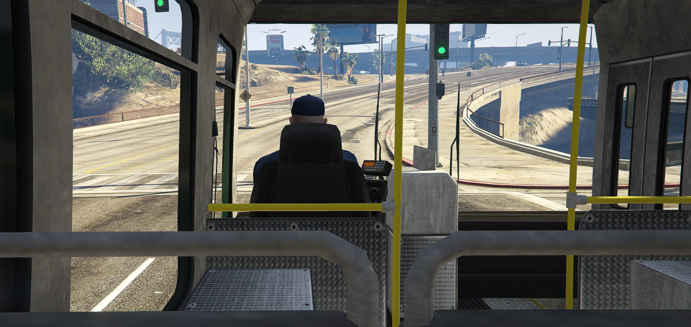

# 🚌 Buspassenger

### 📜 Check Out In Live
- 💬 https://distopia.qzz.io

## 📝 Description
Minimalist and standalone FiveM script that allows the player to board as a passenger to the vehicle models "Bus" and "Airbus" created by the native AI NPC traffic.



## ✨ Features
- **Inmersive environment**: Players can travel free as passenger in buses.

## ⚙️ Installation
- Download zip and extract to resources, or cd in resources then:
```
git clone https://github.com/eth3real-code/buspassenger
```
- And add to server.cfg:
```
ensure buspassenger
```

## 📦 Zero dependencies
- 🙌 None

